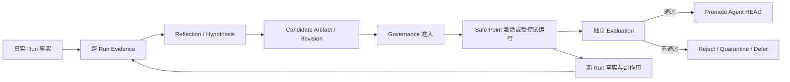

# Anthias 前沿 Agent 原理研究：统一结论

> 研究截止：2026-08-19
>
> 本目录是架构研究与讨论材料，不是 Spec、Plan、Stage 规划或实施授权。
>
> Anthias 当前项目定义、`AGENTS.md` 与技术基线始终高于外部论文、框架和本目录中的研究建议。

## 1. 阅读导航

本轮采用两轮、多分支研究：第一轮分别研究自进化、动态 Runtime 治理和独立 Evaluation；第二轮做 Anthias 适配审查、对抗性红队与证据审计。各报告由不同研究分支独立完成，统一结论由本文件收敛。

| 报告 | 主要问题 | 推荐用途 |
| --- | --- | --- |
| [01-agent-evolution-frontier.md](01-agent-evolution-frontier.md) | 持续身份、长期记忆、Experience、Skill/组件、Revision/Branch 与模型权重分别怎样演化 | 理解“Agent 自进化”包含哪些不同层次 |
| [02-runtime-extensibility-governance.md](02-runtime-extensibility-governance.md) | Agent 自写组件与传统 Plugin/MCP/Skill 如何进入统一 Runtime 生命周期、隔离与 Governance | 理解可执行变化怎样安全进入 Runtime |
| [03-evaluation-safety-frontier.md](03-evaluation-safety-frontier.md) | 怎样独立评价 Candidate，避免一次偶然收益、自评、污染或总分掩盖回归 | 理解什么证据有资格支持 Promotion |
| [04-anthias-fit-review.md](04-anthias-fit-review.md) | 哪些前沿机制应 Adopt、Adapt、Reject 或 Defer | 快速查看 Anthias 适配结论 |
| [05-evolution-red-team.md](05-evolution-red-team.md) | 自我授权、后代污染、stale writer、间接破坏 pin、资源泄漏和不可逆副作用 | 检查方案最容易失真的连接处 |
| [06-evidence-audit.md](06-evidence-audit.md) | 关键主张的来源等级、证据边界、过度外推与时效风险 | 判断哪些结论可靠，哪些只是前沿信号 |

如果只读一份，先读本文件；要追溯理由，再按具体问题进入对应分报告。

## 2. 结论先行

Anthias 不需要因为某篇新论文重写项目定义。现有方向已经处在几条前沿研究线的交叉点：

- DGM 在其 Coding Benchmark 搜索中报告了 archive、分支与 stepping stone 的收益，为 Anthias 保留候选分支提供研究信号；这不证明长期保留在 Anthias 中必然有益；
- Mem2Evolve 直接支持 Experience 与可执行 Asset 形成双向演进；
- AHE 强调每次 Harness 修改应可观察，并绑定可被证伪的预测；
- Agent libOS 强调可见 Action Surface 可以变化，但资源 Authority 不能随之漂移；
- Continuity Kernel 强调保留状态不等于授予权威，Candidate 与 accepted HEAD 必须分离；
- Agent Evaluation 研究说明一次成功、单一 Judge 或单一总分不足以证明长期提升。

但这些工作分别只解决问题的一部分。在本次审查的一手来源范围内，没有发现一个系统同时实证覆盖 Anthias 所要求的：持续 `AgentId`、同一 Run 内的 Runtime 变化、Owner/Scope 生命周期、跨 Run Evidence、Agent 自写组件、Revision/Branch、独立 Evaluation、传统扩展兼容和用户不可绕过的 pin。这是有限来源下的研究结论，不是“世界首创”声明。

基于 Anthias 当前已经确定的不变量，本轮研究收敛的方向不是复制某个框架，而是将前沿机制放回项目已有边界，形成一个最小闭环：

这个闭环可以用“受治理的演化 Runtime”作描述，但它不是新增的正式项目术语，也不规定模块、状态机、Schema、算法或开发阶段。

## 3. Anthias 真正是什么

Anthias 不是传统 Coding Harness 加一层长期 Memory，也不是让模型自动修改 Prompt 后继续运行。它要解决的是：

> 同一个拥有持续身份的 Agent，如何在一次和多次真实任务中留下可复核痕迹，从这些痕迹中发现长期摩擦，提出并亲自编写新的 Skill、Plugin、Tool、Workflow、Provider 或其他组件；同时确保这些变化不自我授权、不破坏运行中的依赖、不重写历史、不绕过用户约束，最后由独立证据决定是否成为新的稳定 Revision。

这决定了几个不能混淆的对象：

| 对象 | Anthias 中的含义 | 不能被误写成什么 |
| --- | --- | --- |
| `AgentId` | 持续身份和演进谱系 | 模型实例、会话、角色、进程或 Candidate 数量 |
| Run | 一次有边界的任务执行 | Agent 的完整生命期 |
| Revision / Branch | 同一 Agent 的稳定版本与可能未来 | 一个新的持续 Agent |
| Composition Epoch | Runtime 细粒度结构快照 | 每次都必须晋升的长期 Revision |
| Ledger / Artifact | 发生事实与不可变产物 | 可被事后反思重写的“故事” |
| Experience / Memory | 从事实派生、可修订的学习结果 | 原始事实本身 |
| Candidate | 尚未获得稳定权威的变化 | 已成功进化的证明 |
| Cognitive Engine | 可替换或可训练的模型 Provider | Agent 身份与 Runtime 的全部 |

多个 Reflector、Evaluator、Runner 或模型调用可以是执行角色，但不应仅因角色隔离就创建新的长期 Agent 身份。DGM archive 中的节点也应映射为同一 `AgentId` 下的 Revision/Branch，而不是一群新 Agent。

## 4. 必须分开的五类演化

“Agent 自进化”不是一个单一动作，更不能由一个总分概括。

1. **同一 Run 内的临时适应**：Runtime 在 Safe Point 改变 Provider、Tool、Skill 或资源组合，由 Composition Epoch 描述；它不自动成为长期 Evolution。
2. **跨 Run 的 Experience / Memory 演化**：从多次任务痕迹中形成可修订的语义、经验或程序性候选；原始 Ledger 事实不被覆盖。
3. **可执行资产与组件演化**：Agent 编写 Skill、Workflow、Tool、Plugin、Provider 或其他组件，先成为 Candidate Artifact，再接受治理、试运行和评价。
4. **演化机制自身的 meta-change**：Reflection、检索、候选生成或评价机制本身发生变化；它不能在同一权力层中修改裁判后自证成功。
5. **模型权重演化**：训练、微调或替换 Cognitive Engine Provider；它是独立演化轴，不吞并 Agent 身份、Runtime、Memory 或 Governance。

在本轮审查的一手来源中，当前最直接、且与 Anthias 高度吻合的研究信号是 Experience 与 Asset 的双向共演化：长期 Evidence 发现反复耗时、失败、绕路或能力缺口，Agent 据此编写新组件；新组件进入受控 Runtime 后又产生新的轨迹和 Evidence。关键限制是：这条循环可以生成 Candidate，不能自己授予运行权威。

## 5. 与当前项目定义一致的四组原则边界

以下是本轮研究所能收敛的“方案”。这里的“合同”表示稳定责任边界，不表示现在就创建四个模块或接口。

### 5.1 Observation / Evidence 边界

- 真实 Run、Tool Call、状态变化、耗时、Token、错误、重试、资源与外部副作用先形成事实。
- Reflection 只能基于事实提出 Hypothesis，不能回写原始事实或把解释冒充结果。
- 长期 Evidence 适合发现模式和产生候选，不足以直接证明因果。
- 所有尝试都应被保留在选择账本中，包括失败、超时、取消、安全阻断和 grader failure；不能只保存“最好的一次”。
- 从事实派生的 Experience、Memory、Workflow 或自模型投影可以被 supersede，但需要保留 provenance 和适用范围。

### 5.2 Candidate / Activation 边界

- Agent 可以写源码、Skill、Workflow、测试、Manifest 与模型更新，但生成不等于激活。
- Candidate 与稳定 HEAD 分离，并绑定精确 Artifact、父 Revision、预期 HEAD/Epoch 和来源 Evidence。
- 每个 Candidate 应声明可证伪主张：希望改善什么、预期保持什么、可能伤害什么。该声明是评价输入，不是成功证明。
- 结构变化仍由 Governance 决策，`RuntimeCoordinator` 作为 Control Plane Single Writer 在 Safe Point 提交完整结果图。
- 动态发现、MCP `tools/list_changed`、文件监听或插件更新只产生 Proposal，不能直接改 Runtime Graph。
- 长 Proposal 在提交前必须重新核对前驱、Epoch、pin、权限、Owner closure 和完整依赖；Single Writer 不能自动消除 stale proposal、ABA 或重复提交风险。

### 5.3 Evaluation / Promotion 边界

- 独立性来自数据、规则、凭据、写权限、完整记录和 Promote authority 的隔离，不是换一个模型名字或角色提示词。
- Proposer 的自测和因果解释可以保留，但只是 proposer evidence；它不能写最终 EvalResult、修改受保护评价面、选择性删失败、Promote、解除 Quarantine 或 Unpin。
- 能由状态、合同、测试、资源和副作用验证的，优先使用硬 oracle；开放结果再组合规则、LLM Judge、Agent Judge、人工或真实观察。
- Candidate 与稳定 baseline 应在可比环境和预算中比较，并区分偶尔成功、稳定成功、正确性、安全、成本、延迟、资源和旧能力回归。
- 公开开发检查、受保护回归、新鲜任务、事故衍生 eval、shadow、canary 和晋级后观察各自为不同问题提供证据；任何一个都不是万能裁判。
- Promotion 只说明 Candidate 在已记录条件下成为稳定 Revision，不是永久认证；后续漂移和新事故仍可触发重新评价或前向恢复。

### 5.4 Authority / Lifecycle 边界

- Consumer 依赖 Capability 合同，不绑定具体 Plugin、Provider、MCP Tool 名或执行载体。
- Plugin、Provider、Tool、Skill、Workflow、MCP Server、进程和交付包是不同维度，不能都叫“插件”。
- 传统 Plugin/MCP/Skill 与 Agent 自写组件进入同一 Proposal、生命周期、Evidence 和 Governance 闭环，但来源不同意味着信任起点、隔离和所需证据可以不同。
- Manifest、签名、构建 provenance 与行为 Evaluation 分别回答不同问题；任何单项都不能证明组件安全或适合长期挂载。
- 所有受管副作用在创建时就需要 Owner、Scope 和释放语义；外部进程只由 `ProcessSupervisor` 持有和终止。
- 普通子进程、ClassLoader、容器名称或数字签名都不能被宣传成完整沙箱。具体隔离产品等真实组件和部署风险出现后再选。

## 6. Plugin、MCP、Skill 与 Agent 自写组件怎样兼容

统一的是治理语义，不是文件格式或执行形态。

| 外部形态 | 进入 Anthias 时保留什么 | 不能获得什么 |
| --- | --- | --- |
| MCP Server | Server provenance、连接/进程 Owner、Tool/Resource/Prompt schema 与 namespace | 直接写 Runtime Graph、绕过授权或把 Tool 名当全局 Capability |
| Skill | 文本/流程 Artifact、版本、触发和依赖 | 因为“只是文本”就继承脚本、进程、文件或网络权限 |
| 传统 Plugin | 原始包、namespace、贡献类型、来源与版本 | 让外部 Harness 的生命周期和 Hook 语义接管 Anthias Runtime |
| Agent 自写组件 | 生成 Evidence、源码、构建产物、测试、自述与 Candidate 谱系 | 因作者是 Agent 自己就获得高信任或直接进入活体 Runtime |

“用户强制开启”也不等于把扩展提升为可信代码，或预先批准它未来的所有调用、权限扩张和自动更新。pin 只表达持续用户意图。

pin 必须由 Agent Revision 之外的 Stable Host 治理域持有，并对变化后的完整 Runtime Graph 做校验。它要阻止的不只是显式 disable/uninstall，还包括移除依赖、关闭 Owner、改变 Provider 优先级或路由、撤销权限、制造不兼容、回到缺失版本、用同名但不等价的对象替代等间接失效。

当 pinned 对象崩溃、泄漏或触发安全隔离时，Host 仍可停止危险执行；但这不会解除 pin。真实状态应同时表达“用户意图仍在”和“当前不可满足/已隔离”，等待安全恢复或用户决定，不能由 Agent 静默换掉或取消。

## 7. 前沿工作怎样映射，而不是怎样照搬

下表中的 Adopt / Adapt 只是研究适配标签，不表示已经授权实施或冻结架构。

| 外部工作 | 可吸收的原理 | Anthias 必须补上的部分 | 判定 |
| --- | --- | --- | --- |
| [Darwin Gödel Machine](https://iclr.cc/virtual/2026/poster/10007327) | archive、parent/branch、非贪心 stepping stone | 同一 AgentId、Runtime 生命周期、用户 pin、真实资源与独立 Promotion | Adapt |
| [Mem2Evolve](https://aclanthology.org/2026.acl-long.952/) | Experience Memory 与 Asset Memory 双向演进 | Asset 只能成为 Candidate；补 Governance、Owner/Scope、Safe Point 和 HEAD | Adopt 原理，Adapt 机制 |
| [Agentic Harness Engineering](https://arxiv.org/abs/2604.25850) | 可编辑组件、分层轨迹、修改绑定可证伪预测 | 它主要修改离线 Harness；自我预测不能替代独立回归检查 | Adapt，预印本 |
| [Agent libOS](https://arxiv.org/abs/2606.03895) | Action Surface 可变但 Authority 经稳定原语控制；未知 effect 不盲目重放 | 不证明 Anthias 的身份、Revision、Evaluation 或语义安全 | Adapt，方向性预印本 |
| [Continuity Kernel](https://arxiv.org/abs/2608.11632) | retention 不等于 authority；候选绑定前驱，只有接受结果推进 HEAD | 极新预印本；协议模型不证明 evaluator 正确、语义正确或现实副作用可逆 | Adapt，不固化 |
| [AlphaEvolve](https://arxiv.org/abs/2506.13131) | 在目标可重复、可量化时用 evaluator 驱动候选搜索 | 演化算法解法，不是具有长期身份和真实 Runtime 的 Agent | Adapt |
| OSGi、MCP、JDK、WASI、供应链规范 | 生命周期、协议、装载、隔离和 provenance 构件 | 它们不是 Agent Evolution，也不定义 Anthias 产品语义 | 局部 Adopt / Adapt |

DGM 在其搜索设置中报告了分支和 stepping stone 的收益，但不定义 Anthias 的身份。Mem2Evolve 在六类任务、八个 benchmark 中报告了 Experience 与 Asset 共演化的增益；这不证明该关系在 Anthias 的长期环境中普遍成立，更不证明资产可以自动挂载。AHE 的强项是可观察与可证伪，不是准确预测回归。新近 Runtime/continuity 预印本适合交叉检查权限和激活边界，不足以重命名或接管 Anthias 的现有领域模型。

## 8. 红队要求的关键修正

### 8.1 未 Promote 资产不能污染稳定学习上下文

Candidate 可以在隔离实验中被观察和继续研究，但在获得权威前，不应进入稳定 Agent 的正常检索、Reflection 或后代蒸馏上下文。否则即使删除源 Skill，错误逻辑也可能已进入后代资产。

[When Self-Evolution Backfires](https://arxiv.org/abs/2608.05810) 在其限定实验中报告了非单调 Skill 积累与 source-only rollback 后的残余退化；这是 2026-08-06 的极新预印本，只提供一个需要认真对待的反例信号。因此不能把“文本可删除”直接当成已被证明的语义可逆性，更不能把论文中的数值或门禁方法固化进 Anthias。

### 8.2 可证伪声明必要，但远远不够

候选应声明预期收益和回归面，但不能据此裁剪独立 Evaluator 的检查范围。AHE 自报的回归预测 precision/recall 很低，说明 Candidate 往往不知道自己会破坏什么。未被候选预测的旧能力和任务切片仍需要观察机会。

### 8.3 回滚不是让世界倒带

切回旧代码或 Runtime Graph 只能改变未来选择，无法自动撤销已发送消息、远端写入、计费、信息泄露、权限撤销、未知 dispatch 或已经传播到后代的经验。

因此恢复应被描述为保留历史的前向事件：旧 Revision 是恢复材料，不是当前世界的完整快照；恢复不能复活旧权限、清除新 pin、盲目重放未知 effect，或把过去失败改写成从未发生。

### 8.4 图可解析不等于 Capability 语义等价

相同 Java interface、MCP schema、名称或健康检查只证明结构条件的一部分。Provider 仍可能改变精度、排序、幂等性、失败分类、隐私边界、成本、超时和副作用。替换证据必须覆盖受影响 Consumer 和真实任务切片，而不只看 Provider 自测。

### 8.5 保护层不能参与普通同层递归自改

Ledger 权威、Evaluation 规则、Governance、`RuntimeCoordinator`、pin 与 kill/quarantine 控制面不能与被测 Candidate 一起变化并相互自证。如果未来确实要演化这些保护层，只能经过更高、独立且仍由用户控制的授权与评价边界；本轮不设计这种递归机制。

## 9. Evaluation 的最小证据观

一次 Candidate 是否值得前进，至少需要回答下列问题；这里不设数字阈值：

| 问题 | 典型证据 | 单独不足的原因 |
| --- | --- | --- |
| 是否完成真实目标 | 状态、测试、任务结果、人工或 Judge | 结果正确仍可能过程越权或有副作用 |
| 是否遵守过程与安全不变量 | 完整轨迹、权限、状态 diff、资源与 side-effect 记录 | 合规不自动证明能力提升 |
| 是否比稳定基线更好 | 匹配预算和环境的 baseline/candidate 对照 | 单一任务可能是偶然或选择偏差 |
| 是否可靠 | 重复运行、任务族切片、旧能力回归 | `best-of-many` 不能代表稳定性 |
| 是否具有因果可解释性 | 控制变量、配对对照、环境与选择机制 | 普通 Ledger 相关性不是因果证明 |
| 是否能受控退出 | 隔离、资源释放、稳定 Revision 可重选、未知 effect 对账 | 代码回滚不能撤销现实副作用 |
| 是否仍适合真实生态 | shadow/canary/晋级后观察（风险允许时） | 离线环境无法覆盖漂移和长尾交互 |

Evaluator 可以是确定性程序、规则、隔离模型、不同模型、人工或组合。真正的独立性是 Candidate 不能控制评价资产、Runner 事实、失败纳入规则、Evaluator 写入、Governance 决定与 Runtime Mutation，而不是把一个 LLM 角色命名为“独立评估 Agent”。

## 10. 明确拒绝的方向

- 允许 Agent 直接覆盖活体 Harness Core、当前加载目录或评价规则，然后用自己的测试宣布成功。
- 用 Spring AI 或其他 SDK 代替 Anthias 自己实现的 Agent Loop 与 Runtime 语义。
- 把 Reflection、长期 Memory、Skill 数量、一次任务收益或单一总分直接称为 Evolution。
- 把每个 Candidate、Branch、Evaluator、模型实例或执行进程创建成新的持续 Agent。
- 让 Candidate 修改受保护测试、Ledger、HEAD、Governance、pin、权限原语或失败证据。
- 把 MCP 动态列表、文件监听或插件自更新直接变成 Runtime Graph 写操作。
- 把签名、Manifest、ClassLoader、普通子进程或容器名称当作完整安全证明。
- 把所有传统扩展和 Agent 自写组件放到相同信任级别，或反过来建立两套彼此不兼容的治理权威。
- 用同名对象、断依赖、改路由、撤权限、关闭 Owner 或制造持续故障间接绕过用户 pin。
- 把 Quarantine 中的资产继续喂给稳定 Agent，等待它“自然证明自己”。
- 用速度或成本收益平均掉正确性、安全、旧能力或资源释放失败。
- 把结构回滚宣传为现实副作用、信息泄露和后代污染已经撤销。

## 11. 当前应当 Defer 的问题

这些问题需要真实 Feature 和运行 Evidence 逐步暴露，现在不应为了完整而提前设计：

- 什么粒度的变化创建 Revision，什么只推进 Composition Epoch；
- Memory 的失效、降权、supersession、遗忘和隐私保留规则；
- 复杂 archive 搜索、parent selection、Branch 合并和 stepping stone 产品语义；
- 在线模型训练、参数内化和模型 Provider 归属；
- Agent 生成组件采用 JVM、进程、WASM、容器还是 microVM；
- Capability 版本算法、Provider 选择、Manifest Schema 和状态枚举；
- Evaluation 样本数、重复次数、置信方法、权重、阈值和统一评分公式；
- shadow/canary 的比例、时长、用户范围和自动回退条件；
- pin 默认固定精确 Artifact、Provider，还是某 Capability 始终可用；
- 外部不可逆副作用的通用补偿协议；
- Evaluation、Governance 和演化机制自身的递归演化；
- 插件市场、自动更新、PKI、透明日志和完整供应链平台。

## 12. 证据等级与阅读边界

| 等级 | 典型来源 | 本轮可支持什么 | 不能支持什么 |
| --- | --- | --- | --- |
| 项目权威 | 项目定义、`AGENTS.md`、技术基线 | Anthias 当前语义和不变量 | 这些机制已经被代码或长期运行验证 |
| 同行评审研究 | DGM、Mem2Evolve、AgentDojo 等明确会议版本 | 特定机制在给定 benchmark、模型和环境中的实证信号 | Anthias 长期 Runtime、安全或生产可靠性 |
| 官方规范/源码/API | MCP、JDK、OSGi、NIST、SLSA、TUF | 协议、API、权限或工程控制的公开语义 | 自进化收益或对 Anthias 的直接适用性 |
| 机构一手研究/工程实践 | AlphaEvolve、OpenAI/Anthropic Evaluation、Google SRE | 特定实验、部署观察或工程控制原则 | 可直接复制的通用 Agent 架构 |
| 近期预印本/原型 | AHE、Agent libOS、Continuity Kernel、污染研究 | 新问题、反例、方向和待验证机制 | 成熟共识、长期证明或应立即冻结的核心机制 |

来源状态必须逐项判断，不能把 2026 年工作笼统称为预印本：DGM 已有 ICLR 2026 正式页面，A-MEM 是 NeurIPS 2025，MemEvolve 是 ICML 2026 / PMLR 306，Mem2Evolve 是 ACL 2026；AHE、Agent libOS、Continuity Kernel 与 Backfires 等仍属于预印本或早期原型。正式发表提高来源成熟度，但不会把限定 benchmark 结果扩大成长期 Runtime 安全证明。

研究中出现的数字只在原论文的任务、模型、预算与评测环境内成立。尤其不能把 benchmark 提升外推为长期安全，不能把软件发布/供应链类比写成 Agent Evolution 的直接实证，也不能把最新预印本的状态名、协议或算法静默变成 Anthias 正式设计。

本轮证据审计实际复核了高影响来源的正文或官方摘要，但没有逐页重新打开全部链接，也没有复现实验、重算统计或检查训练数据污染。所有论文数字仍是作者报告；具体核对范围见 [06-evidence-audit.md](06-evidence-audit.md)。

关键一手来源包括：

- [DGM（ICLR 2026）](https://iclr.cc/virtual/2026/poster/10007327)
- [Mem2Evolve（ACL 2026）](https://aclanthology.org/2026.acl-long.952/)
- [MemEvolve（ICML 2026 / PMLR 306）](https://openreview.net/pdf?id=qpkG0eKx4v)
- [Agentic Harness Engineering](https://arxiv.org/abs/2604.25850)
- [Agent libOS](https://arxiv.org/abs/2606.03895)
- [Beyond Memory: A Transactional Continuity Kernel](https://arxiv.org/abs/2608.11632)
- [When Self-Evolution Backfires](https://arxiv.org/abs/2608.05810)
- [AlphaEvolve](https://arxiv.org/abs/2506.13131)
- [Anthropic：Demystifying evals for AI agents](https://www.anthropic.com/engineering/demystifying-evals-for-ai-agents)
- [OpenAI：Trustworthy third-party evaluations](https://openai.com/index/trustworthy-third-party-evaluations-foundations/)
- [MCP Specification 2026-07-28](https://modelcontextprotocol.io/specification/2026-07-28)

完整来源与逐主张边界见 01—06 分报告，尤其是 [06-evidence-audit.md](06-evidence-audit.md)。

## 13. 最终收敛

基于当前项目定义，本轮收敛的方向不是“让 Agent 随便改自己”，也不是“把 Agent 锁死成固定 Harness”，而是让同一个持续 Agent 真正拥有发现问题、编写组件和提出变化的能力，同时不拥有把候选变成权威的单方面权力。

最终保留的最小原则是：

1. 一个稳定 `AgentId`，多条 Revision/Branch；模型和组件变化不自动改变身份。
2. 每一步留下原始事实；Reflection 只产生可推翻的 Hypothesis。
3. Experience 与可执行 Asset 双向演进，但未 Promote 候选不进入稳定学习上下文。
4. 生成不等于激活；Candidate 与 HEAD 分离，结构变化由 Governance 与 Single Writer 在 Safe Point 执行。
5. Action Surface 可以变化，Authority、Owner/Scope、ProcessSupervisor、pin 和保护层不能随 Candidate 隐式漂移。
6. 独立 Evaluation 是数据、规则、权限、记录和 Promotion 决策的分离；不由 Proposer 自证。
7. 评价保留正确性、可靠性、成本、延迟、安全、资源、旧能力和退出能力，关键失败不被总分平均。
8. Plugin、MCP、Skill 与 Agent 自写组件统一进入 Anthias 生命周期与 Governance，但保留不同形态、来源和信任起点。
9. pin 校验最终 Runtime Graph；安全停止不等于解除用户意图。
10. 回滚是保留历史的前向恢复，不伪造现实世界和后代学习从未受过影响。

这组原则已经足够指导后续从简单到复杂的真实开发，也足够阻止本轮研究膨胀成一套尚无事实支撑的庞大设计。具体模块、协议、阈值与实施顺序，留给未来真实 Feature 再讨论。
